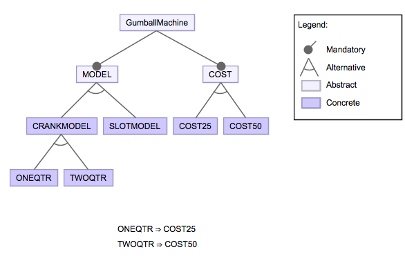
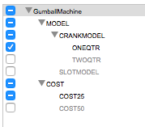
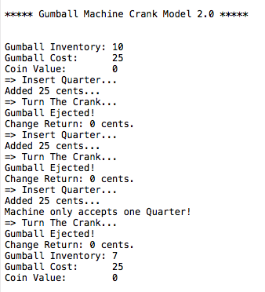
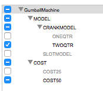
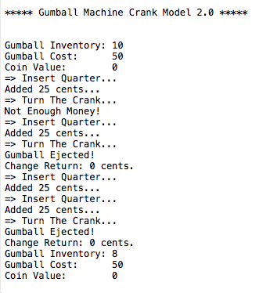
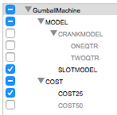
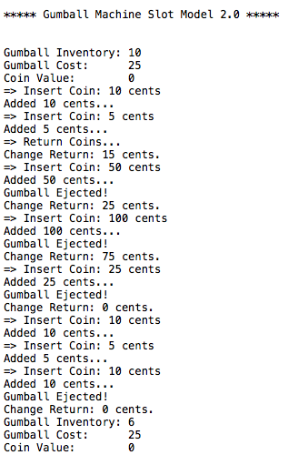
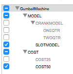
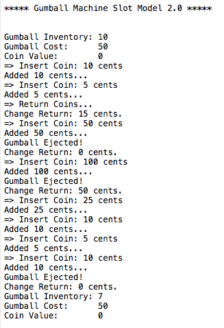

# Summary

## Comparison between FeatureIDE GumballMachine with AspectJ and Lab1 GumballMachine

### 1. Lab1 GumballMachine

* In lab 1, if we want to have different types of gumball machine which includes "single quarter crank gumball machine", "double quarter crank gumball machine" and "any quarter slot gumball machine", we need to implement three class for them.

* To test three gumball machines, we have to write three test function to test them separately.

### 2. FeatureIDE GumballMachine with AspectJ

* In feature IDE project of gumball machine, we can use different aspects to stands for crank model, slot model and cost of gumball, etc.

  * Advantage: We do not have to implement all classes for each type of gumball machine. Instead we implement just one GumballMachine and some aspects of it and configure gumball machine by using feature model.

* To test gumball machine, we use feature model to configure different model for gumball machine.

  * Advantage: No need to write different testing code. Testing can be done by configure different model.

### 3. Feature model and output results

* Feature Mode

  

* Output Results

  * Choose CRANKMODEL, COST25 and ONEQTR

    

    

  * Choose CRANKMODEL, COST50 and TWOQTR

    

    

  * Choose SLOTMODEL, COST25 and ONEQTR

    

    

  * Choose SLOTMODEL, COST25 and ONEQTR

    

    
