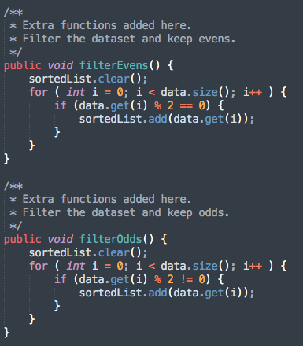
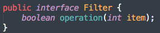
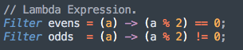
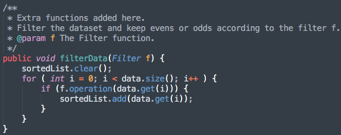
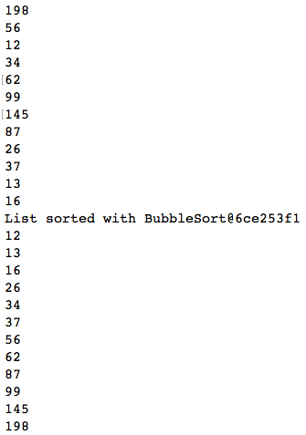
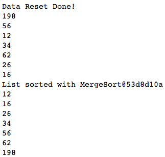
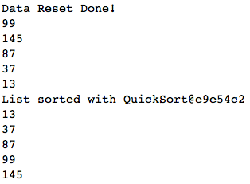

# Summary

## Comparison between normal function and lambda expression

### 1. Normal function in strategy pattern

* These functions are used to filter the data set. Function 'filterEvens()' keeps even number. Function 'filterOdds()' keeps odd number. Two functions have a lot of repetitive code.

### 2. Lambda expression in strategy pattern

* The Advantages of using lambda expression:
  * Enable to treat functionality as a method argument.
  * By using lambda expression, we can avoid too much of repetitive code which is fulfilled by passing function to the method.

### 3. Results

* The data without filtering. Using bubble sort strategy.

* Only keep even data. Using merge sort strategy.

* Only keep odd data. Using quick sort strategy.

